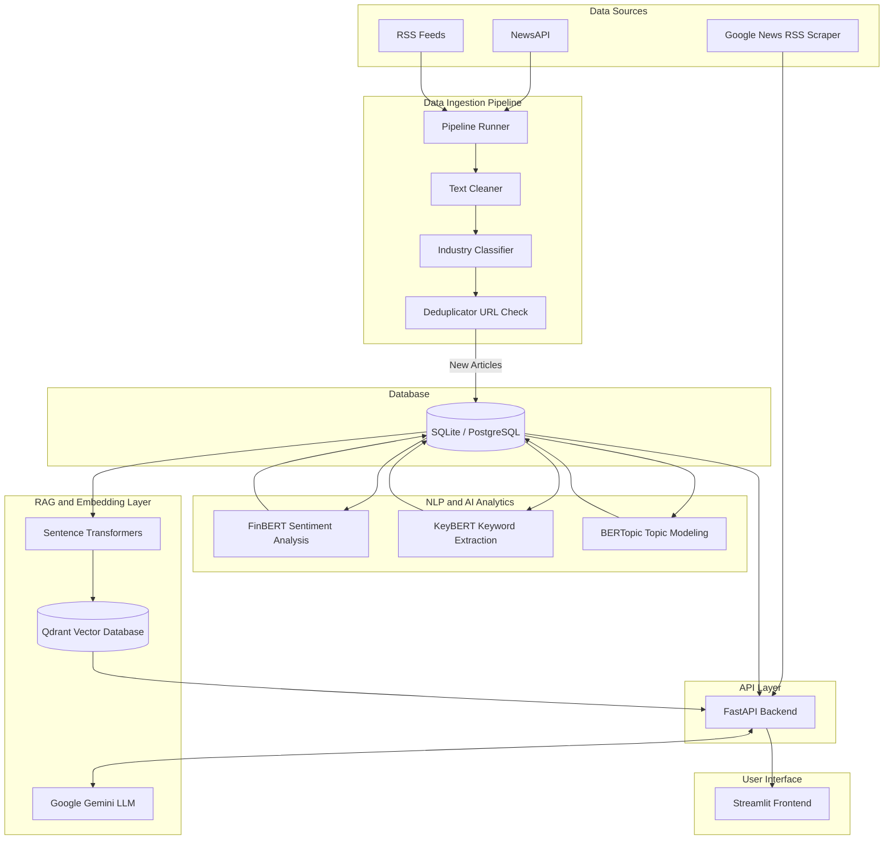
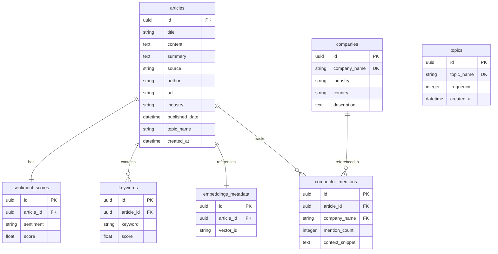

# Scout - Market Intelligence and Competitor Research Platform

Scout is an AI-powered market intelligence and competitor research platform designed to monitor industry trends, analyze competitors, perform semantic research, and extract insights from unstructured news feeds and articles. It provides a full-stack solution featuring a FastAPI backend, a Streamlit frontend, an automated data ingestion pipeline, real-time natural language processing (NLP) analytics, and Retrieval-Augmented Generation (RAG).

## Architecture Overview

The system consists of five primary components:
1. Data Ingestion Pipeline: Periodically fetches news articles and RSS feeds, cleans HTML boilerplate, classifies industry context, deduplicates URLs, and indexes data.
2. Relational Database: Stores structured metadata about articles, companies, competitor mentions, keywords, topics, and sentiment scores.
3. Natural Language Processing Services: Executes sentiment analysis via FinBERT, keyword extraction via KeyBERT, and topic modeling using BERTopic.
4. RAG and Vector Search Layer: Embeds article contents using Sentence Transformers and indexes them into Qdrant for semantic search and question answering via Google Gemini.
5. User Interfaces: Streamlit application serving interactive dashboards, market explorers, competitor SWOT matrixes, live Google News product query scrapers, and an AI research analyst.

### System Architecture and Ingestion Pipeline



## Database Schema

The platform supports both SQLite (default for development) and PostgreSQL (for production). The database schema maps relationships between ingested articles, companies, competitor mentions, and NLP analytical models.



## Features

### 1. Data Ingestion Pipeline
- Collects articles from NewsAPI and curated RSS feeds.
- Normalizes publication dates and cleans HTML tags/boilerplate text.
- Classifies articles into target industries (Logistics, Pharma, Agriculture, Defense, or General fallback) using custom keyword and context heuristics.
- Deduplicates incoming streams based on URL uniqueness.

### 2. Market Analytics and Intelligence
- Sentiment Analysis: Automatically assigns positive, neutral, or negative classifications with confidence scores.
- Keyword Extraction: Extracts critical contextual keywords for topic trends and tag clouds.
- Topic Modeling: Groups documents dynamically using BERTopic (UMAP, HDBSCAN, and TF-IDF config) and exposes weekly topic modeling batch runs.
- Trend Velocity: Analyzes keyword and topic frequency shifts over time to alert on rising market phenomena.

### 3. Competitor and Product Intelligence
- Tracks a hardcoded watchlist of major global enterprises (Tesla, Samsung, Apple, Google, Nvidia, etc.) inside text content.
- Measures mention frequency, calculates sentiment distributions specifically for competitor contexts, and extracts snippet quotes.
- Feeds live product analysis queries into RSS news feeds, runs real-time brand detection and lexical sentiment scoring, and generates automated SWOT analyses.

### 4. RAG AI Research Analyst
- Indexes processed articles into a vector database (Qdrant).
- Provides semantic search, document retrieval, and conversational query resolution.
- Generates structured research reports using Google Gemini, citing original source articles and links.

## Project Structure

```
├── .env.example          # Environment variables template
├── alembic.ini           # Alembic database migration configuration
├── docker-compose.yml    # Docker services orchestration
├── requirements.txt      # Python dependencies
├── analytics/            # NLP analytics engine
│   ├── keyword_extraction/
│   ├── sentiment/
│   ├── topic_modeling/
│   └── trends/
├── backend/              # FastAPI server
│   ├── api/              # API endpoints and route definitions
│   ├── schemas/          # Pydantic validation schemas
│   └── services/         # Business logic layer
├── data_pipeline/        # Data ingestion and scheduled jobs
│   ├── collectors/       # NewsAPI and RSS scrapers
│   ├── processors/       # Cleaning and classification modules
│   └── scheduler/        # Orchestration script
├── database/             # SQLAlchemy connection & models
│   ├── migrations/       # Alembic version control
│   └── models/           # Declarative base models
├── docker/               # Container configurations (Backend, Frontend)
├── frontend/             # Streamlit application UI pages
└── tests/                # Unit and integration test suites
```

## Tech Stack

- Backend Framework: FastAPI (Uvicorn server)
- Frontend Framework: Streamlit
- Database ORM: SQLAlchemy, Alembic (Migrations)
- Vector Search: Qdrant Client
- Large Language Model: Google Generative AI (Gemini)
- NLP and ML Libraries: PyTorch, Sentence Transformers, KeyBERT, BERTopic, HDBSCAN, UMAP-Learn, FinBERT
- Containerization: Docker, Docker Compose
- Testing: PyTest

## Installation and Setup

### Prerequisites
- Python 3.10 or higher
- Qdrant Cloud or local instance (Optional, mock active otherwise)
- NewsAPI Key and Google Gemini API Key

### Local Setup

1. Clone the repository and navigate to the project directory:
   ```bash
   git clone https://github.com/shekharsameer2308/LLM-.git
   cd LLM-
   ```

2. Create and activate a virtual environment:
   ```bash
   python -m venv venv
   # On Windows:
   venv\Scripts\activate
   # On macOS/Linux:
   source venv/bin/activate
   ```

3. Install requirements:
   ```bash
   pip install -r requirements.txt
   ```

4. Configure environment variables:
   Copy `.env.example` to `.env` and fill in the required keys (database URL, API keys, and endpoint configurations).

5. Run database migrations:
   ```bash
   alembic upgrade head
   ```

6. Run the FastAPI backend:
   ```bash
   uvicorn backend.main:app --host 127.0.0.1 --port 8000 --reload
   ```

7. Run the Streamlit frontend in a separate terminal:
   ```bash
   streamlit run frontend/app.py
   ```

8. Execute the Ingestion Pipeline manually:
   ```bash
   python -m data_pipeline.scheduler.pipeline_runner --run-topics
   ```

### Docker Compose Setup

Run the entire platform including a PostgreSQL instance, FastAPI backend, Streamlit frontend, and pipeline runner:
```bash
docker-compose up --build
```
Access the Streamlit application at `http://localhost:8501` and the backend FastAPI docs at `http://localhost:8000/docs`.

## Running Tests

Execute the test suites using pytest:
```bash
pytest tests/
```
